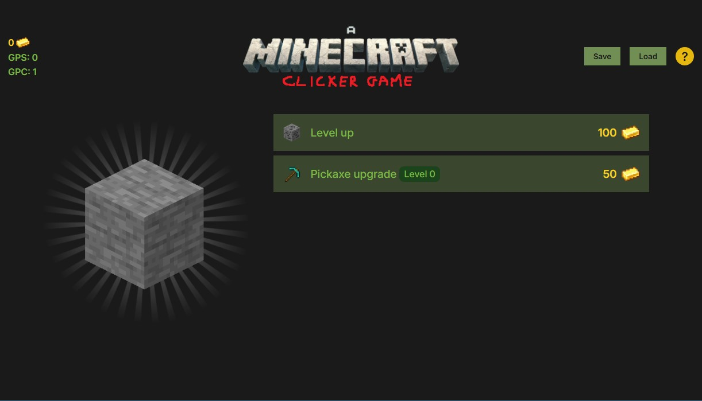

# A Minecraft Clicker Game

This is a browser-based clicker game developed as a university project during the fourth semester. Inspired by the mechanics of incremental games and the aesthetics of Minecraft, the game invites players to earn gold by clicking a giant block, upgrading their gear, and automating their mining operation.




## Features

- **Click to Mine**: Earn gold by clicking the main block.
- **Keyboard Shortcuts**:
  - `M` – Mine automatically for lazy gains.
  - `O` – Upgrade your level and boost your gold-per-click.
  - `P` – Upgrade your pickaxe for better performance.
- **Progression System**: Advance through mining levels with increasing rewards.
- **Intro Screen**: An interactive and humorous tutorial introduces the player to the game mechanics.
- **Responsive UI**: Works in various screen sizes, with dynamic layout and animations.

## Technologies Used

- **HTML**: Page structure and elements.
- **CSS**: Styling and custom themes inspired by Minecraft.
- **JavaScript**: Core game logic, event handling.
- **jQuery**: DOM manipulation and animations.

## Installation and Setup

1. Clone the repository:

   ```bash
   git clone https://github.com/tothbence0531/clicker-game.git
   ```

2. Open `index.html` in a web browser to start the game — no server setup needed.

## Usage

1. Click the block to earn gold.
2. Use keyboard shortcuts to level up and enhance your mining tools.
3. Watch your gold pile up and aim for the top mining tiers.
4. Enjoy the humorous in-game commentary and visuals.

## Project Details

- **Semester**: 4. semester
- **University**: SZTE
- **Developer**: Tóth Bence (D952NT)
- **Technologies**: HTML, CSS, JavaScript, jQuery

## License

This project is for educational purposes only.
